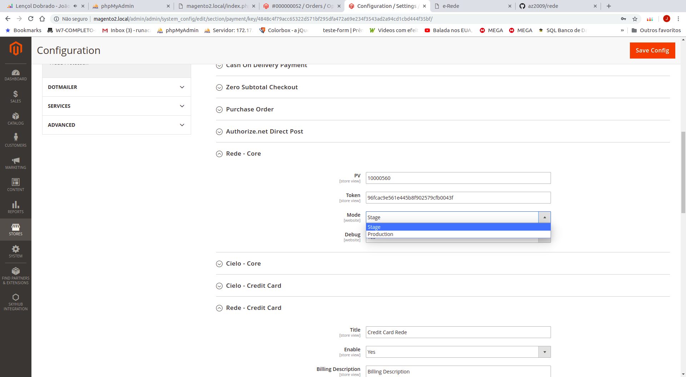
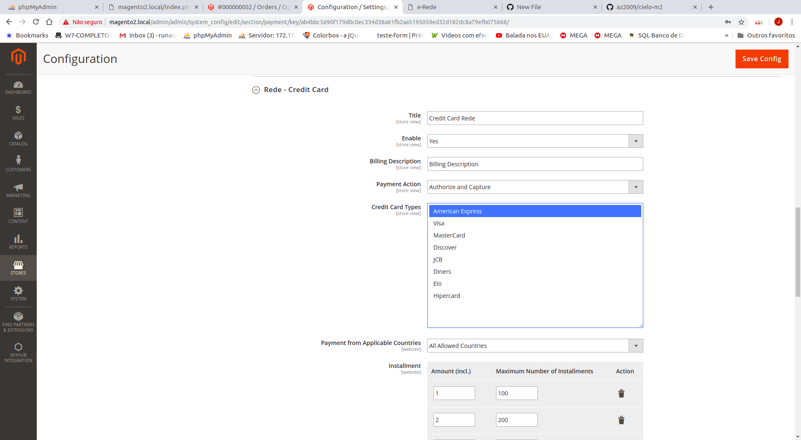
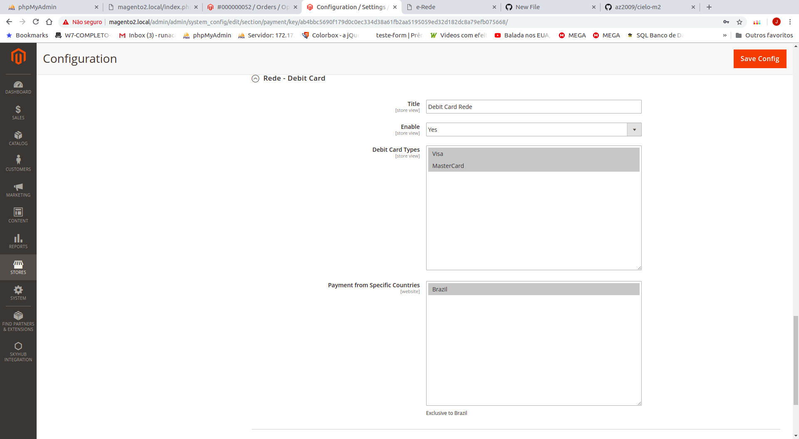
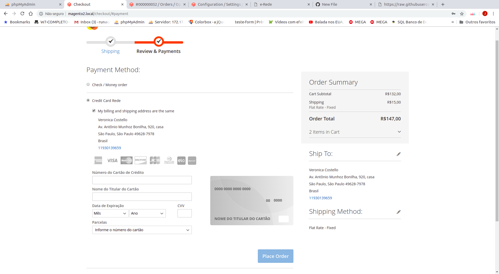
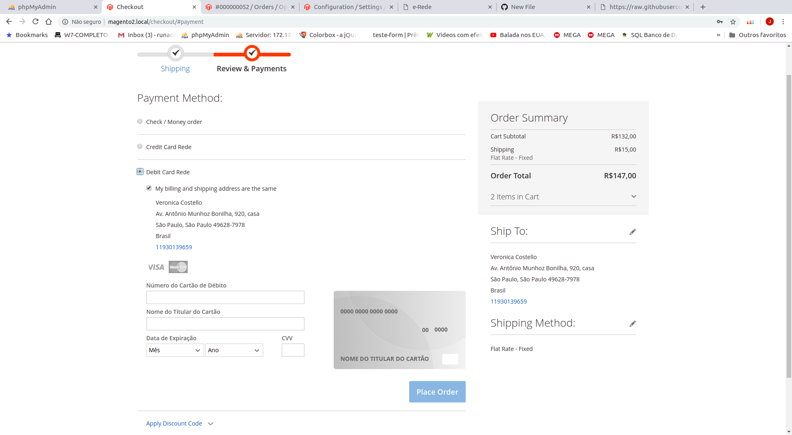
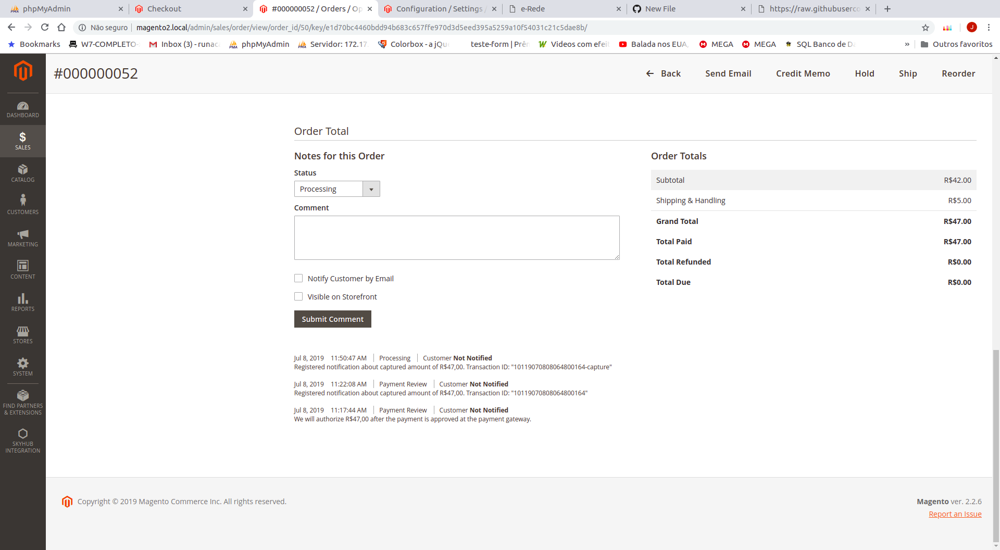
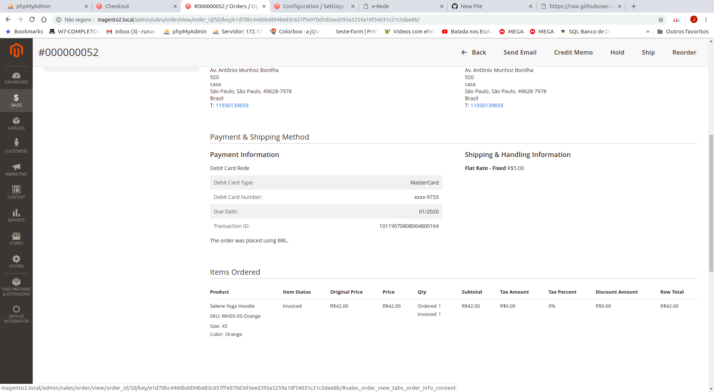

<strong>Configuração da chave</strong>
 
 

<strong>Configuração Cartão de Crédito</strong> 
  
 
  
<strong>Configuração Cartão de Débito</strong>
  
  
 
<strong>URL de Postback</strong> 
  http://SUALOJA.COM.BR/index.php/rede/postback/index/
   - Recebe o parâmetro "tid"(Id da Transação)   
 

<strong>Telas Gerais</strong>
 

<strong>Cartão de Crédito</strong>
  
 

<strong>Cartão de Débito</strong>
    
    
<strong>Comentários das ações de pagamento</strong>
    
    
<strong>Detalhes de pagamento do pedido</strong>
    